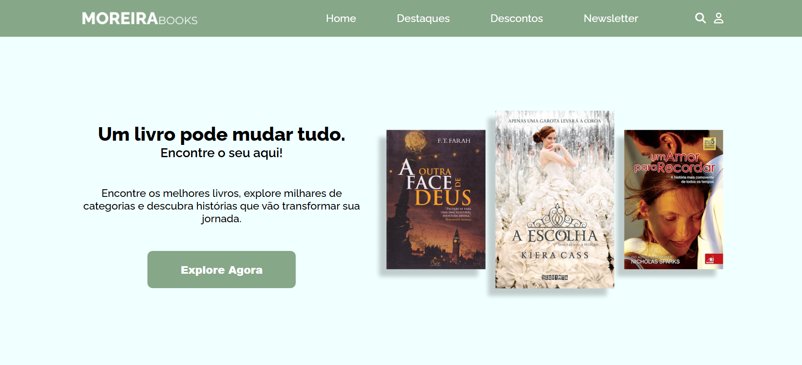

# 📚 E-commerce de Livros  

> Projeto de e-commerce de livros, onde temos seções de **destaques**, **descontos**, **newsletter**, entre outras. Este projeto foi inspirado por uma ideia da minha namorada e foi um desafio incrível para mim!  

## 📸 Imagem do Projeto  
  

## 🔗 Acesse o Projeto  
🔗 [E-commerce de Livros - Live Site](https://moreirabooks.vercel.app/)   

## 🛠️ Tecnologias Utilizadas  
- HTML5  
- CSS3 (incluindo **CSS Grid** para layout e estilização)  
- Responsividade com **CSS Media Queries**  

## 📦 Como visualizar o projeto localmente  
```bash
# Clone o repositório
git clone https://github.com/fcdias0812/MoreiraBooks

# Acesse a pasta do projeto
cd MoreiraBooks

# Abra o arquivo index.html no navegador
```

## 🎯 Aprendizados  
Esse projeto foi um grande desafio para mim, onde aprendi e pratiquei conceitos novos como:  
✔️ **CSS Grid** para criar layouts complexos e responsivos  
✔️ Desenvolvimento de **menus responsivos** para melhorar a navegação  
✔️ Estruturação e estilização avançada de seções de e-commerce  

Passei muitas horas nesse projeto, mas o resultado foi muito gratificante. Além disso, foi uma excelente oportunidade para crescer como desenvolvedor e aplicar os conhecimentos de forma prática.

## 📞 Contato  
📧 Email: dias.fabricio0812@gmail.com  
💼 LinkedIn: [Acesse meu LinkedIn](https://www.linkedin.com/in/fcdias0812/)  
👨🏻‍💻 devChallenges: [Acesse meu devChallenges](https://devchallenges.io/profile/ddc059be-9eb4-40fb-b8cd-6f8dcd32b468)  
